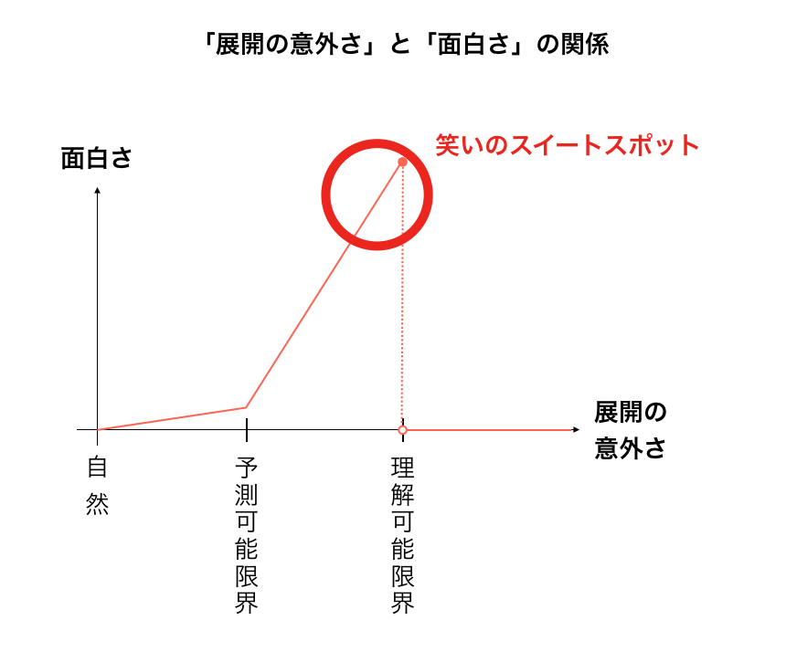

# マヂカルラブリーM1最終決戦を３日間かけて分析してわかってきた面白さのメカニズム

- Date: 2020.12/24

- Authour: ven-kyoshiro

  

## 前振り

　2020年ももう終わりますがみなさんはM１グランプリ，もう見ましたか？見逃してしまった方は是非，[公式ホームページ](https://www.m-1gp.com/)から一ヶ月間全ネタが見られるようなので，年末年始に見ることを強くお勧めします．優勝したのはマヂカルラブリーで，このネタが本当に面白かった．なんでこんなに面白いのか，お笑いの素人である私なりに時間をかけて分析したので記事にまとめました．

　この記事では，M1に限らずあらゆる「笑い」に共通する面白さの理論を提唱し，面白さを感じさせるための技術を列挙，最終的にはマヂカルラブリー決勝ネタでそれらの工夫がどのように使われていたかを紹介します．

## TL;DR（要点）

- なぜ私たちは面白さを感じるのか面白さの理論

  - 面白さは**展開の意外さ**で評価できる

  - 笑いの**スイートスポット**は**理解可能だが予測不能**な展開に存在する

    

- 笑いのスイートスポットをいかに攻めるか理論を生かした技術

  - 全員笑わせるためには聞き手の**予測可能限界**と**理解可能限界**を操作する

  - ツッコミの役割は，**理解不能**から**理解可能**へのガイド

    

- マヂカルラブリー最終決戦ネタ分析

  - **理解不可能な野田の奇行**に対する村上の丁寧なガイド
  - 徐々に**理解可能領域を広げて**からの最後の御茶ノ水

## なぜ私たちは面白さを感じるのか　面白さの理論

　全ての物質が物理法則に従って動いているように，お笑いにも物理法則のような核となる仕組みがあるはずです．今日は私が発見した１つの原則を紹介します．まず，コンビニに行った話の例を考えてみましょう．この展開a~eでどれが一番面白いか考えながら読んでみてください． 

　ここで，展開a ~eの展開の意外さを考えてみましょう．展開が何も意外でない場合は　**自然**，展開が意外さを増していくと，**予測が難しく**なり，展開が意外すぎてしまうと，**理解すらできない**展開もあると思います．  

　私なりにa~eの展開をこの数直線上に並べてみると以下のようになりました．  

次に，それぞれの展開の面白さを採点してきます．

- **a. 昨日コンビニに行ったら，コンビニ店員がいた．**
  - 当たり前，つまらない　0.1点
- **b. 昨日コンビニに行ったら，地元の友達にあった**
  - おっ，そうなんや．地元とやしな．1点
- **c. 昨日コンビニ行ったら，デニス植野が働いてた**
  - まじか，最近見ないと思ったら，今度行ってみよ．3点
- **d. 昨日コンビニ行ったら，ガリガリ君いくら味が売ってた**
  - コンポタ味の時から心配してたけど，赤城乳業もついにとち狂ったか．6点
- **e. 昨日コンビニに行ったら，異世界に転生してしまった．**
  - 意味不明，めんどくさ．0点

私の採点にご納得いただけると良いですが，とりあえず，面白さを縦軸にとって，並べてみます． 

 

展開の意外さが小さい時，①予測の範囲内から一歩も出ないことを言われても，面白い　とはなりません．②予測の範囲を超えてくると，少しずつ面白さが増していくと思います．しかし，③展開が意外すぎると，理解すらできなくなり，たちまちその展開は面白くないものになってしまいます．①と③がいわゆる，滑った状態に該当します．もちろん，展開の意外さは人によって個人差があるので，同じ展開でも，面白いと思う人がいたり，いなかったりするのです．

　まとめます． 

**展開の意外さ**と**面白さ**には上図のような関係があると考えられます．私たちは話を聞く時，無意識に次の展開を予想していて，その時に感じる意外さが面白さへと繋がっているのです．一番面白いと感じるのは，予測不可能だが，ギリギリ理解可能な領域に話が来た時です．記事ではこの箇所を**笑いのスイートスポット**と呼ぼうと思います．このスイートスポットを攻めた分だけ，聞き手は面白さを感じ笑ってくれるので，ここをどれだけ攻められるかが，話全体の面白さに繋がってきます．

## 笑いのスイートスポットをいかに攻めるか　理論を生かした技術

　それでは，ここまでで紹介した理論を生かした具体的な技術を見ていきましょう

### 全員を笑わせるためのテクニック

先ほど， 

> 展開の意外さは人によって個人差があるので，同じ展開でも，面白いと思う人がいたり，いなかったりする

と述べましたが，これに加えて，予測の得意不得意，理解の得意不得意もあるので同じ一言で会場を沸かすのは大変難しいことなのです．次の３人の例を考えましょう <  

これは，話を聞いているある瞬間のある３人のそれぞれの，面白さと展開の意外さの関係を並べた図です．今回はグラフを貫く水色の直線の箇所を狙って，話を展開をしようと考えています．まさにその一言で笑いを取ろうとする瞬間です．普通に話しを聞いていた普通の人は，スイートスポットに入りそうなので笑ってくれることが期待されます．しかし，下の２人は笑ってくれなそうです．２段目の頭の回転が早い人は，次の一言をある程度予測できてしまっているので，面白く感じられず，また，下段のネタに置いてかれた人は，ネタの途中が聞き取れなかったり，ぼーっと見ていてネタに置いてかれてしまったのでしょう，この人にとってはどんな一言が来ても理解不能なのでもちろん面白く感じられません．

　こう行った状況を避けるにはどうしたら良いのでしょうか．その答えは，「**聞き手の理解可能領域を広げ，予測可能領域を狭める**」です．単語がいかついので，１つづつご説明します．

- **聞き手の理解可能領域を広げる**

  

  理解の領域を広げるとは，聞き手を置いていかないように話すと言うことです．これを達成するための多くのテクニックがすでに存在し，これらは超基本かもしれませんが最も重要なことです．いかに列挙します

  - 聞き取りやすく話す工夫

    - 滑舌
    - 速度

  - 話を聞く気にさせる工夫

    - 認知度
    - 話題選定，目的設定，掴み
    - 感情移入エピソード
    - 抑揚

  - 飛躍のない展開

    - 飛躍してもツッコミでフォロー
    - あるあるを挟む
    - 話者のキャラクターへの理解

    

- **聞き手の予測可能領域を狭める**

   

  予測の領域を狭めるとは，要するにオチがバレないようにすることです．「聞き手の理解可能領域を広げる」が超基本に対して，こちらはどちらかと言うともう一工夫，スパイス的な要素になります．これを達成するよくある工夫は以下です．

  - ミスリード
    - 間違った予測をしやすいようなヒントを話に混ぜる
  - テンポ
    - あえて畳み掛けるように速く喋り，考える隙を与えない

  - 笑い責め
　
    - 笑っている間は予測の範囲が狭まる

　これら２つの「**聞き手の理解可能領域を広げ，予測可能領域を狭める**」を駆使して，聞き手がそのオチで笑いやすい状態になれるようにコントロールすることが，全員を笑わせれための秘訣なのではないでしょうか．

### ボケ・ツッコミでなぜ面白くなるのか

　コンビで行うお笑いではよく，ボケ，ツッコミという役割分担がされています．この役割分担は実は今日紹介した面白さの理論を最大限生かした手法なのです．まず，「ボケ」とはなんでしょうか．先ほどの例題を思い出してください．展開が意外すぎて，理解できる限界を超えている展開eは，「ボケ」として捉えることができます．この記事において「ボケ」とは，理解の限界を超えた展開と定義します．

 

先ほどの採点の通り，これだけではなにも面白くありません．ここにツッコミを付け足してみましょう．

 

素人の考えたツッコミなのでぎこちないかもしれませんが，それぞれのツッコミは成立していると思います．このツッコミを付け足すことで何が起こるかを表した図が以下です．

 

**理解できない展開（＝ボケ）を，後付けで理解できるものにするガイド（＝ツッコミ）**と言う構図がみて取れると思います．理解可能と不可能の間を行き交うので，スイートスポットが非常に狙いやすいのがこの手法の特徴です．まとめるならば，**ボケ・ツッコミは一度理解不能な領域に出てから，スイートスポットを狙いに行く手法**と言えるでしょう．

## マヂカルラブリー最終決戦ネタ分析

　さて，以上を踏まえてマヂカルラブリーの最終決戦ネタを分析していきたいと思います．時系列順に要所要所箇条書きで書いていきます．

- 「吊革につかまりたくない人」

  -  
  - 技：**聞き手の理解可能領域を広げる**
    - 理解可能な出だし
    - そう言う人いるっちゃいる，
    - 口調でキャラを伝える

- 最初はフラフラするところまでは予測の範囲

- しかし野田（敬称略）のフラフラのキモさは，予想を少し超える＝面白い

   

- 野田のトイレ，からの謎ジェスチャー，，おしっこかかってるのは村上のツッコミで初めてわかる
   

  - 技：ボケ・ツッコミ

- 徐々になんでも起こり得そうと言う心の準備ができてくる

  - 徐々に，やばい列車
  - 技：**理解可能領域を広げる**

- 吊革取れて，電撃，列車内重力

  - 理解可能領域が広がるにつれて，ボケもエスカレート
    - 技：ボケ・ツッコミ
      - ずっと成立

- 最後の御茶ノ水

  -  
  - 
  - **なんでも起こりそうと思わせて，理解可能領域を広げる**
    **と同時に，予測可能は狭められていた**
    - 技：ミスリード
      - この世にないぐらいの暴走列車のイメージが皆の頭に
    - 頭の回転が早い人ほど「御茶ノ水」で笑ったのでは？

- 全体

  次々繰り出される笑いの技，まさに笑いの数え役満でした．理解可能領域の拡大と，それに合わせたボケのエスカレート＋しっかりしたツッコミ，理解可能領域拡大（どんなことでも起こりそうな路線）によるミスリードも面白さを感じたポイントだった思います．お笑いに詳しい友人に聞くと，今回のネタはブラックマヨネーズの最初のデートどこ行こうか話してたら，いつの間にかボーリングの玉持って

## 結び

実は笑いのメカニズムって突き詰めればシンプルなんじゃないかと言う楽観的な思いつきから，はじめて真面目にお笑いを分析してみましたが，自分の中で腑に落ちるメカニズムとして整理することができたので満足です．今回紹介した理論の範疇にない面白さの要因（例えば他の人がどれくらい笑っているかなど）もたくさんあると思うので，この記事は参考程度に思っていたらければ幸いです．この理論をもとに，自分でおもしろ話を考え友達に話してみたのですが，あまり受けなかったので，分析したからといって，自分がネタを作れるようになったわけではなさそうです．

- 固いパンの話
- モアイの話
- 

## 参考文献

- 今回の面白さの理論は勝手に考えたものですが，笑いの理論がまとまった資料を紹介します
- この記事に近いような（認知科学的な）視点から笑いとは何かに迫る本
  - [ヒトはなぜ笑うのか ユーモアが存在する理由](https://amzn.to/2JfVEFA)
    - マシュー・Ｍ．ハーレー （著）,[ダニエル・Ｃ．デネット （著）,[レジナルド・Ｂ．アダムズＪｒ． （著）,片岡 宏仁 （訳）
- 哲学的な笑い知識体系がまとまった文献
  - [ロボットのためのコメディー - 笑いを哲学する試論](https://repository.kulib.kyoto-u.ac.jp/dspace/bitstream/2433/71121/1/prospectus11_Sakon.pdf)
    - 佐金 武さん
- キャッチーでわかりやすい笑いの理論紹介コラムを掲載するサイト
  - [WARAI+ コラム](http://waraiplus.com/colum/)

## 謝辞

- M1を見ながらひたすら分析するのに付き合ってくれたKYT大　D研　T中Y一氏
- 3150のネタを生み出してくださった芸人さん方

